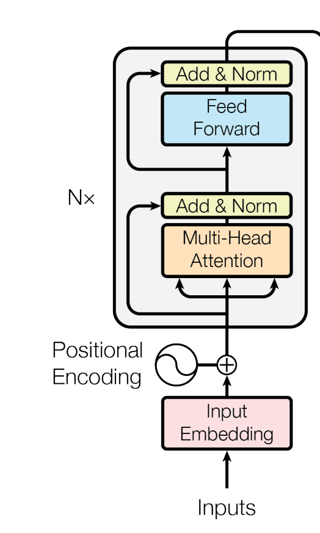

`BERT`出来也很久了，之前一直都是远远观望，现在因为项目需要，想在`BERT`的基础上尝试，因此认真研究了一下，也参考了几个`BERT`的实现代码，最终有了这个文章。

本文适合对`Transformer`比较了解的同学，如果不太了解`Transformer`及其相关的知识点，建议预先了解一下。

这里有一些不错的关于`Transformers`的资料：

* 论文 - [Attention is All You Need](https://arxiv.org/abs/1706.03762)
* [The Illustrated Transformer](https://jalammar.github.io/illustrated-transformer/)
* [Transformer model for language understanding](https://www.tensorflow.org/tutorials/text/transformer)

当然，`BERT`也有一些非常棒的资料：

* 论文 - [BERT: Pre-training of Deep Bidirectional Transformers for Language Understanding](https://arxiv.org/abs/1810.04805)
* [The Illustrated BERT, ELMo, and co.](http://jalammar.github.io/illustrated-bert/)
* [A Visual Guide to Using BERT for the First Time](http://jalammar.github.io/a-visual-guide-to-using-bert-for-the-first-time/)


对于`BERT`的代码实现，我主要是看了以下几个，大家也可以参考：

* [huggingface/transformers](https://github.com/huggingface/transformers)
* [google-research/bert](https://github.com/google-research/bert)
* [tensorflow/models/official/nlp](https://github.com/tensorflow/models/tree/master/official/nlp)

第一个`huggingface/transformers`的实现有`pytorch`和`tensorflow`实现，整体上还是非常棒的。主要有以下优点：

* 各个SOTA模型都有实现，并且更新速度很快
* 这个库可以很方便地加载预训练好的模型，然后直接使用
* 可以使用`tensorflow`训练模型和保存，然后使用`pytorch`加载，进行后面的运算

当然，我没有选择直接使用它而是自己实现，主要原因是：

* 因为网络原因，模型下载太困难 ，导致一些简单的例子和实验都跑不通
* 我只需要`BERT`，而不需要其他部分，不必杀鸡用牛刀

后面两个实现`google-research/bert`和`tensorflow/models/official/nlp`都是Google自己的实现。代码上只能说是一言难尽。

* `google-research/bert`使用的是`tf.estimator API`实现，代码组织还可以，但是还是不如`tf.keras API`来得清晰，并且有不少是处理`TPU`上训练的代码，对于我们普通人来说，`TPU`和我们有啥关系呢？
* `tensorflow/models/official/nlp`使用的是`tf.keras API`实现，但是代码实在是弯弯绕绕，活生生写成了`tf 1.x`的样子，不知道是不是阿三哥提交的代码。。。

于是，有了自己实现的一份代码：
* [luozhouyang/transformers-keras](https://github.com/luozhouyang/transformers-keras)

好了，废话不多说。

## BERT模型的整体结构

首先，我们掌握一下大致的结构，然后逐步实现每一块。

`BERT`在结构上比`Transformer`要简单，因为`BERT`只用了`Transformer`的`Encoder`部分。

懒得找图片了，用文字概括一下模型的要点吧：

* `Embedding`层，包括`token embedding`、`position embedding`和`segment embedding`，所以喂入网络的输入也不仅仅是`tokens`这么简单。
* `Encoder`层，实际上是多层`encoder`的堆叠。基本上和`Transformer`里的`encoder`保持一致。其中的`multi-head attention`也是一样的。
* 对于预训练模型，有两个任务，一个是`Masked Language Model`，一个是`Next Sentence Prediction`二分类任务。

到这里也就能理解为什么`BERT`叫做`预训练语言模型`了，因为训练这个模型，使用了以上两个任务，但是我们在`BERT`的基础上进行微调的时候，是可以丢掉上面两个任务，转而在`Encoder`层后面接上自己的任务的。

可以发现，`BERT`至少在模型上，是比较简单的，相对于`Transformer`来说，至少没有`Decoder`层啊。

接下来，咱们逐步实现以上各个部分。

首先，安装依赖：

```bash
!pip install -q tensorflow==2.0.1
```

```python
import tensorflow as tf
```

## 模型参数

为了让`BERT`模型参数配置更方便，我们单独把它的模型设置参数独立出一个类。主要配置如下：

```python
class BertConfig(object):

    def __init__(self, **kwargs):
        super().__init__()
        self.vocab_size = kwargs.pop('vocab_size', 21128) # vocab size of pretrained model `bert-base-chinese`
        self.type_vocab_size = kwargs.pop('type_vocab_size', 2)
        self.hidden_size = kwargs.pop('hidden_size', 768)
        self.num_hidden_layers = kwargs.pop('num_hidden_layers', 12)
        self.num_attention_heads = kwargs.pop('num_attention_heads', 12)
        self.intermediate_size = kwargs.pop('intermediate_size', 3072)
        self.hidden_activation = kwargs.pop('hidden_activation', 'gelu')
        self.hidden_dropout_rate = kwargs.pop('hidden_dropout_rate', 0.1)
        self.attention_dropout_rate = kwargs.pop('attention_dropout_rate', 0.1)
        self.max_position_embeddings = kwargs.pop('max_position_embeddings', 512)
        self.max_sequence_length = kwargs.pop('max_sequence_length', 512)
```

应该看名字就知道是啥，这里也就不多解释了 。

## Embedding层

刚刚上面也说了，不同于`Transformer`，它只有`token embedding`和`positional embedding`，但是`BERT`的`embedding`包括三个：
* `token embedding`，和`transformer`是一致的
* `position embedding`，和`transformer`不一样，`transformer`使用三角函数来实现`位置编码`,而`BERT`使用`绝对位置`来进行`位置编码`
* `segment embedding`，主要是为了区分不同的序列


`BERT`预训练模型的输入，是一个序列。但是有一个`NSP`任务，它是对两个序列的分类任务，通常来说需要两个序列单独输入。那么怎么解决这个矛盾呢？

很简单，**把两个序列拼接起来！**

这里的拼接，不是直接第二个序列跟在第一个序列后面，也是有技巧的。具体做法为：

* 在序列的开头出加上一个`[CLS]`标记。这个标记有其他用处，后文会说明。
* 在第一个序列结尾处，增加`[SEP]`标记
* 在第二个序列结尾出，增加`[SEP]`标记

但是这样还不够，虽然合成了一个序列，但是对于模型来说，它无法区分哪些token是第一个序列的，哪些是第二个序列的啊。所以，额外引入了一个`segment embedding`，也就是说，用不同的数字来标记不同序列的token。第一个序列的token标记`0`，第二个序列的token标记`1`，以此类推。。。

给个例子直观感受下模型的输入是啥样子：

```bash       
                    [CLS] bert is awesome . [SEP] i love it [SEP]
   token ids:       100   34   3  6       5 101   2 9    4  101
position ids:       0     1    2  3       4 5     6 7    8  9
 segment ids:       0     0    0  0       0 0     1 1    1  1
```

应该很清楚了，对于一个序列，三个`embedding`的输入就是这么简单。都转化为`ID`之后，在各个的`embedding`矩阵，直接索引即可获得对应的表示。这个和传统的`token embedding`是一摸一样的。

`position embedding`就很简单了，为了让模型学习到token的位置信息，对token进行了**绝对位置编码**，就是直接对token所处的位置，进行编号。

各个`BERT`实现默认的最大`position`为`512`，也就是说我们的网络会构建出一个`512 * hidden_size`的二维矩阵。如果你的使用场景里，序列长度是大于`512`并且不能删减的话，你可以自己更改这个参数`config.max_position_embeddings = x(例如1024)`。

所以代码实现很简单：

```python

class BertEmbedding(tf.keras.layers.Layer):

    def __init__(self, config, **kwargs):
        super().__init__(name='BertEmbedding')
        self.vocab_size = config.vocab_size
        self.hidden_size = config.hidden_size
        self.type_vocab_size = config.type_vocab_size

        self.position_embedding = tf.keras.layers.Embedding(
            config.max_position_embeddings,
            config.hidden_size,
            embeddings_initializer=tf.keras.initializers.TruncatedNormal(stddev=0.02),
            name='position_embedding'
        )
        self.token_type_embedding = tf.keras.layers.Embedding(
            config.type_vocab_size,
            config.hidden_size,
            embeddings_initializer=tf.keras.initializers.TruncatedNormal(stddev=0.02),
            name='token_type_embedding'
        )
        self.layer_norm = tf.keras.layers.LayerNormalization(epsilon=1e-12, name='LayerNorm')
        self.dropout = tf.keras.layers.Dropout(config.hidden_dropout_rate)

    def build(self, input_shape):
        with tf.name_scope('bert_embeddings'):
            self.token_embedding = self.add_weight(
                'weight',
                shape=[self.vocab_size, self.hidden_size],
                initializer=tf.keras.initializers.TruncatedNormal(stddev=0.02)
            )
        super().build(input_shape)

    def call(self, inputs, training=False, mode='embedding'):
        # used for masked lm
        if mode == 'linear':
            return tf.matmul(inputs, self.token_embedding, transpose_b=True)

        input_ids, token_type_ids = inputs
        position_ids = tf.range(input_ids.shape[1], dtype=tf.int32)[tf.newaxis, :]
        if token_type_ids is None:
            token_type_ids = tf.fill(input_ids.shape.as_list(), 0)

        position_embeddings = self.position_embedding(position_ids)
        token_type_embeddings = self.token_type_embedding(token_type_ids)
        token_embeddings = tf.gather(self.token_embedding, input_ids)

        embeddings = token_embeddings + token_type_embeddings + position_embeddings
        embeddings = self.layer_norm(embeddings)
        embeddings = self.dropout(embeddings, training=training)
        return embeddings

```

代码里的`token embedding`就是对输入序列的`embedding`，`position embedding`就是序列的位置编码，`token_type_embedding`就是`segment embedding`。


## Multi-head attention

`embedding`层之后，是`Transformer`里的`encoder`层，默认一般是`12`层`encoder`堆叠而成。`encoder`里面有一个很重要的概念，就是`multi-head attention`。这个`attention`机制和`Transformer`里面是一摸一样的。

我们知道`multi-head attention`的内部是一个`scaled dot-product attention`。并且在`Transformer`的`encoder`部分，是`self-attention`，因为计算`attention score`的`Q、K、V`三个张量是相同的。

关于`attention`的介绍，可以查看我另外一篇文章：[Attention机制](2018-09-10-attention_mechanism.md)

简单回顾一下`scaled dot-product attention`:


`scaled dot-product attention`的计算公示如下：

$$\text{Attention}(Q,K,V)=softmax(\frac{QK^T}{\sqrt d_k})V$$

我们的`Multi-head attention`就是把输入的`Q、K、V`三个张量，分成`n`个`head`之后，每个`head`分别计算`scaled dot-product attention`。然后又因为是`self-attention`，所以`Q、K、V`三个张量是一样的，所以我们的输入参数简化成一个即可。

以下是代码实现：

```python

class BertAttention(tf.keras.layers.Layer):
    """Multi-head self-attention mechanism from transformer."""

    def __init__(self, config, **kwargs):
        super().__init__(name='BertAttention')
        self.num_attention_heads = config.num_attention_heads
        self.hidden_size = config.hidden_size
        assert self.hidden_size % self.num_attention_heads == 0
        self.attention_head_size = self.hidden_size // self.num_attention_heads
        self.wq = tf.keras.layers.Dense(
            self.hidden_size, kernel_initializer=tf.keras.initializers.TruncatedNormal(stddev=0.02), name='query'
        )
        self.wk = tf.keras.layers.Dense(
            self.hidden_size, kernel_initializer=tf.keras.initializers.TruncatedNormal(stddev=0.02), name='key'
        )
        self.wv = tf.keras.layers.Dense(
            self.hidden_size, kernel_initializer=tf.keras.initializers.TruncatedNormal(stddev=0.02), name='value'
        )
        self.attention_dropout = tf.keras.layers.Dropout(config.attention_dropout_rate)

        self.dense = tf.keras.layers.Dense(
            self.hidden_size, kernel_initializer=tf.keras.initializers.TruncatedNormal(stddev=0.02), name='dense'
        )
        self.layer_norm = tf.keras.layers.LayerNormalization(epsilon=1e-12, name='LayerNorm')
        self.hidden_dropout = tf.keras.layers.Dropout(config.hidden_dropout_rate)

    def call(self, inputs, training=False):
        hidden_states, attention_mask = inputs
        batch_size = tf.shape(hidden_states)[0]

        query = self.wq(hidden_states)
        key = self.wk(hidden_states)
        value = self.wv(hidden_states)

        def _split_heads(x):
            x = tf.reshape(x, shape=[batch_size, -1, self.num_attention_heads, self.attention_head_size])
            return tf.transpose(x, perm=[0, 2, 1, 3])

        query = _split_heads(query)
        key = _split_heads(key)
        value = _split_heads(value)

        attention_score = tf.matmul(query, key, transpose_b=True)
        dk = tf.cast(hidden_states.shape[-1], tf.float32)
        attention_score = attention_score / tf.math.sqrt(dk)

        if attention_mask is not None:
            attention_mask = tf.cast(attention_mask[:, tf.newaxis, tf.newaxis, :], dtype=tf.float32)
            attention_mask = (1.0 - attention_mask) * -10000.0
            attention_score = attention_score + attention_mask

        attention_score = tf.nn.softmax(attention_score)
        attention_score = self.attention_dropout(attention_score, training=training)

        context = tf.matmul(attention_score, value)
        context = tf.transpose(context, perm=[0, 2, 1, 3])
        context = tf.reshape(context, (batch_size, -1, self.hidden_size))

        # layer norm
        _hidden_states = self.dense(context)
        _hidden_states = self.hidden_dropout(_hidden_states, training=training)
        _hidden_states = self.layer_norm(hidden_states + _hidden_states)

        return _hidden_states, attention_score

```

值得注意的是，上面的代码实现考虑了`attention_mask`。这里的`attention_mask`和`Transformer`里面的`attention_mask`是有区别的。

在`Transformer`里面的`mask`其实需要考虑到两种：

* `padding mask`，也就是禁止`attention weights`分配在在`padding token`这些位置
* `look-ahead mask`，实际上是考虑到序列的方向，为了遮蔽未来的词语

但是，在`BERT`里面，这里的`attention_mask`仅仅是`padding mask`。不考虑方向，实际上也就是变成了`双向`。这也就是`BERT`中`B`的含义：`bidirectional`。

代码中的`hidden_state`就是`scaled dot-product attention`公式所需要的`Q、K、V`。

## Encoder层

实现了最重要的`multi-head attention`，现在我们可以把完整的`encoder`部分实现了。

也没有多少其他额外的东西，还是用`Transformer`论文的一张图来展示以下结构（注意`BERT`的输入不同，不仅仅是`input embedding + positional encoding`）：



所以我们很容易可以实现代码：

```python
def gelu(x):
    cdf = 0.5 * (1.0 + tf.math.erf(x / tf.math.sqrt(2.0)))
    return x * cdf


def gelu_new(x):
    cdf = 0.5 * (1.0 + tf.tanh((np.sqrt(2 / np.pi) * (x + 0.044715 * tf.pow(x, 3)))))
    return x * cdf


def swish(x):
    return x * tf.sigmoid(x)


ACT2FN = {
    "gelu": tf.keras.layers.Activation(gelu),
    "relu": tf.keras.activations.relu,
    "swish": tf.keras.layers.Activation(swish),
    "gelu_new": tf.keras.layers.Activation(gelu_new),
}

class BertIntermediate(tf.keras.layers.Layer):

    def __init__(self, config, **kwargs):
        super().__init__(**kwargs)
        self.dense = tf.keras.layers.Dense(
            config.intermediate_size, kernel_initializer=tf.keras.initializers.TruncatedNormal(stddev=0.02)
        )
        if isinstance(config.hidden_activation, tf.keras.layers.Activation):
            self.activation = config.hidden_activation
        elif isinstance(config.hidden_activation, str):
            self.activation = ACT2FN[config.hidden_activation]
        else:
            self.activation = ACT2FN['gelu']

    def call(self, inputs, traning=False):
        hidden_states = inputs
        hidden_states = self.dense(hidden_states)
        hidden_states = self.activation(hidden_states)
        return hidden_states


class BertEncoderLayer(tf.keras.layers.Layer):

    def __init__(self, config, **kwargs):
        super().__init__(name='BertEncoderLayer')
        self.attention = BertAttention(config)
        self.intermediate = BertIntermediate(config)
        self.dense = tf.keras.layers.Dense(
            config.hidden_size,
            kernel_initializer=tf.keras.initializers.TruncatedNormal(stddev=0.02)
        )
        self.dropout = tf.keras.layers.Dropout(config.hidden_dropout_rate)
        self.layer_norm = tf.keras.layers.LayerNormalization(epsilon=1e-12, name='LayerNorm')

    def call(self, inputs, training=False):
        hidden_states, attention_mask = inputs
        _hidden_states, attention_score = self.attention(inputs=[hidden_states, attention_mask], training=training)
        outputs = self.intermediate(inputs=_hidden_states)
        outputs = self.dense(outputs)
        outputs = self.dropout(outputs, training=training)
        outputs = self.layer_norm(_hidden_states + outputs)
        return outputs, attention_score


class BertEncoder(tf.keras.layers.Layer):

    def __init__(self, config, **kwargs):
        super().__init__(name='BertEncoder')
        self.encoder_layers = [BertEncoderLayer(config) for _ in range(config.num_hidden_layers)]

    def call(self, inputs, training=False):
        hidden_states, attention_mask = inputs
        all_hidden_states = []
        all_attention_scores = []
        for _, encoder in enumerate(self.encoder_layers):
            hidden_states, attention_score = encoder(inputs=[hidden_states, attention_mask], training=training)
            all_hidden_states.append(hidden_states)
            all_attention_scores.append(attention_score)

        return all_hidden_states, all_attention_scores

```

前面是几个新的`激活函数`，这个应该不需要解释。

`BertEncoder`返回的内容有：

* 各个`BertEncoderLayer`的`hidden_state`组成的`list`，`hidden_state`的形状为`(batch_size, sequence_length, hidden_size)`
* 各个`BertEncoderLayer`的`multi-head attention weights`组成的`list`，`multi-head attention weights`的形状为`(batch_size, num_heads, sequence_length, sequence_length)`

其中，`hidden state`是很重要的，后续的两个任务`Masked Language Model`和`Next Sentence Prediction`都依赖这个输出。而`attention weights`在后面的层中就没有其他处理了。

## Masked Language Model

`Encoder`出来之后，有两个任务，其中一个就是`Masked Language Model`。

什么是`Masked Language Model`呢？可以用一句话概括一下：**对于输入的序列，按照一定概率随机替换原始token成[MASK]，然后试图让模型重建原始的输入序列**。

还记得一开始`Embedding`层的输入吗？我们复用一下：

```
 original tokens:       [CLS] bert is awesome . [SEP] i love it [SEP]
       token ids:       100   34   3  6       5 101   2 9    4  101
    position ids:       0     1    2  3       4 5     6 7    8  9
     segment ids:       0     0    0  0       0 0     1 1    1  1

   masked tokens:       [CLS] bert is [MASK]  . [SEP] i love it [SEP]
masked token ids:       100   34   3  103     5 101   2 9    4  101
    position ids:       0     1    2  3       4 5     6 7    8  9
     segment ids:       0     0    0  0       0 0     1 1    1  1
 ```

我们训练的时候的输入，使用的是`mask`之后的`masked token ids`作为输入，进入到`BertEmbedding`层。

既然我们的`Masked Language Model`是重建原始的输入序列，那很容易想到，我们这个任务的输出，是一个三维张量：`(batch_size, sequence_length, vocab_size)`，代表着序列中的每一个位置都是一个在词典中词语的完整概率分布。

然后使用这个概率分布，和真实的输入序列，使用`交叉熵（crossentropy）`来计算损失。

代码实现如下：

```python
class BertMLMHead(tf.keras.layers.Layer):
    """Masked language model for BERT pre-training."""

    def __init__(self, config, embedding, **kwargs):
        super().__init__(**kwargs)
        self.vocab_size = config.vocab_size
        self.embedding = embedding
        self.dense = tf.keras.layers.Dense(
            config.hidden_size,
            kernel_initializer=tf.keras.initializers.TruncatedNormal(stddev=0.02),
            name='dense'
        )
        if isinstance(config.hidden_activation, tf.keras.layers.Activation):
            self.activation = config.hidden_activation
        elif isinstance(config.hidden_activation, str):
            self.activation = ACT2FN[config.hidden_activation]
        else:
            self.activation = ACT2FN['gelu']

        self.layer_norm = tf.keras.layers.LayerNormalization(epsilon=1e-12)

    def build(self, input_shape):
        self.bias = self.add_weight(shape=(self.vocab_size,), initializer='zeros', trainable=True, name='bias')
        super().build(input_shape)

    def call(self, inputs, training=False):
        hidden_states = inputs
        hidden_states = self.dense(hidden_states)
        hidden_states = self.activation(hidden_states)
        hidden_states = self.layer_norm(hidden_states)
        hidden_states = self.embedding(inputs=hidden_states, mode='linear')
        hidden_states = hidden_states + self.bias
        return hidden_states

```

那么`call(self, inputs, training=False)`方法里的`hidden_states`是什么呢？

之前我们说过，`Encoder`出来的`hidden states`后面会用到，那么就是这里了。这里的`hidden_states`就是**最后一层**`Encoder`输出的`hidden_states`。

## Next Sentence Prediction

另一个任务即`NSP(Next Sentence Prediction)`，就是**第二个序列是否是第一个序列的下一句**这样一个简单的`二分类`任务。

这个任务的输入有点技巧。

还记得一开始的`[CLS]`这个特殊的记号吗？我们的`NSP`任务就需要从最后一层`Encoder`的`hidden_states`里取出这个`[CLS]`标记的向量表示。

`hidden_state`取出`[CLS]`很简单，因为`[CLS]`标记一定是在输入序列的第一个位置。我们使用一个`Pooler`层来取出这个`[CLS]`，然后通过一个全连接层转换一下，作为二分类网络的输入。

```python
class BertPooler(tf.keras.layers.Layer):

    def __init__(self, config, **kwargs):
        super().__init__(**kwargs)
        self.dense = tf.keras.layers.Dense(
            config.hidden_size,
            kernel_initializer=tf.keras.initializers.TruncatedNormal(stddev=0.02),
            activation='tanh',
            name='pooler'
        )

    def call(self, inputs, training=False):
        hidden_states = inputs
        # pool the first token: [CLS]
        outputs = self.dense(hidden_states[:, 0])
        return outputs
```

那我们的`NSP`任务就完成了：

```python
class BertNSPHead(tf.keras.layers.Layer):
    """Next sentence prediction for BERT pre-training."""

    def __init__(self, config, **kwargs):
        super().__init__(**kwargs)
        self.classifier = tf.keras.layers.Dense(
            2,
            kernel_initializer=tf.keras.initializers.TruncatedNormal(stddev=0.02),
            name='sequence_relationip'
        )

    def call(self, inputs, training=False):
        pooled_output = inputs
        relation = self.classifier(pooled_output)
        return relation
```

就是在`Pooler`层后面再加一个全连接层作为二分类输出。然后这个输出，和真实的标签，计算**交叉熵**。

## 预训练的BERT模型

至此，我们预训练`BERT`模型的主要部分都已经实现了。现在来组装一下：

```python

class Bert4PreTrainingModel(tf.keras.layers.Layer):

    def __init__(self, config, **kwargs):
        super().__init__(**kwargs)
        self.bert = BertModel(config, name='Bert')
        self.mlm = BertMLMHead(config, self.bert.bert_embedding, name='MLM')
        self.nsp = BertNSPHead(config, name='NSP')

    @tf.function
    def call(self, inputs, training=False):
        outputs = self.bert(inputs, training=training)
        sequence_output, pooled_output, all_hidden_states, all_attention_scores = outputs
        prediction_scores = self.mlm(sequence_output, training=training)
        relation_scores = self.nsp(pooled_output)
        return prediction_scores, relation_scores, pooled_output, all_hidden_states, all_attention_scores
```

然后，构建出模型，然后可以利用`tf.keras`的`fit`完成模型训练。

```python

def build_bert_for_pretraining_model(config, training=True, **kwargs):
    input_ids = tf.keras.layers.Input(shape=(config.max_sequence_length,), dtype=tf.int32, name='input_ids')
    input_mask = tf.keras.layers.Input(shape=(config.max_sequence_length,), dtype=tf.int32, name='input_mask')
    token_type_ids = tf.keras.layers.Input(shape=(config.max_sequence_length,), dtype=tf.int32, name='token_type_ids')

    outputs = Bert4PreTrainingModel(config)(
        inputs=[input_ids, token_type_ids, input_mask],
        training=training)
    prediction_scores, relation_scores, pooled_output, all_hidden_states, all_attention_scores = outputs
    predictions = tf.keras.layers.Lambda(lambda x: x, name='predictions')(prediction_scores)
    relations = tf.keras.layers.Lambda(lambda x: x, name='relations')(relation_scores)
    pooled_output = tf.keras.layers.Lambda(lambda x: x, name='pooled_output')(pooled_output)
    all_hidden_states = tf.keras.layers.Lambda(lambda x: x, name='all_hidden_states')(all_hidden_states)
    all_attention_scores = tf.keras.layers.Lambda(lambda x: x, name='all_attention_scores')(all_attention_scores)

    model = tf.keras.Model(inputs={
        'input_ids': input_ids,
        'input_mask': input_mask, # 即用于attention计算的attention mask
        'token_type_ids': token_type_ids,
    }, outputs=[predictions, relations, pooled_output, all_hidden_states, all_attention_scores])

    model.compile(
        optimizer=tf.keras.optimizers.Adam(learning_rate=3e-5, epsilon=1e-18),
        loss={
            'predictions': tf.keras.losses.SparseCategoricalCrossentropy(from_logits=True),
            'relations': tf.keras.losses.SparseCategoricalCrossentropy(from_logits=True)
        },
        metrics={
            'predictions': ['acc'],
            'relations': ['acc']
        })
    return model

```

以上是构建模型的函数，以下是一个训练的示例：

```python
class BertModelTest(tf.test.TestCase):

    def testBuildPretrainingModel(self):
        # 构建模型
        config = BertConfig(vocab_size=15, max_sequence_length=8)
        model = build_bert_for_pretraining_model(config, True)

        # 伪造输入
        inputs = {
            'input_ids':  tf.constant([1, 2, 3, 4, 5, 6, 7, 8], shape=(1, 8), dtype=tf.int32),
            'input_mask': tf.constant([1, 1, 1, 1, 1, 1, 1, 0],  shape=(1, 8), dtype=tf.int32),
            'token_type_ids':  tf.constant([0, 0, 0, 0, 1, 1, 1, 1], shape=(1, 8),  dtype=tf.int32)
        }

        labels = {
            'relations': tf.constant([1], shape=(1,),  dtype=tf.int32),
            'predictions': np.random.randint(low=0, high=14, size=(1, 8,))
        }

        x_dataset = tf.data.Dataset.from_tensor_slices(inputs)
        y_dataset = tf.data.Dataset.from_tensor_slices(labels)
        dataset = tf.data.Dataset.zip((x_dataset, y_dataset))
        train_dataset = dataset.repeat(100).batch(2)
        print(next(iter(train_dataset)))

        # 设置各种callback，训练模型
        model.fit(
            train_dataset, 
            validation_data=train_dataset,
            callbacks=[
                tf.keras.callbacks.ModelCheckpoint(
                filepath='/tmp/bert-keras', save_freq='epoch'), #每个epoch之后保存一个Checkpoint格式的模型
                tf.keras.callbacks.EalyStopping(monitor='val_loss', patience=3), #早停，在验证集损失连续3次没有改善则停止训练
                tf.keras.callbacks.TensorBoard(log_dir='/tmp/bert-keras/tensorboard'), #把结果可视化集成到tensorboard
            ]
        )

        # 导出训练的模型到`SavedModel`格式，`tensorflow serving`可以直接部署该模型，并且提供`RPC`和`HTTP`两种接口供外部服务调用。
        model.save('/tmp/keras_bert_example', include_optimizer=False, save_format='tf')

    def testLoadSavedModel(self):
        inputs = {
            'input_ids':  tf.constant([1, 2, 3, 4, 5, 6, 7, 8], shape=(1, 8), dtype=tf.int32),
            'input_mask': tf.constant([1, 1, 1, 1, 1, 1, 1, 0],  shape=(1, 8), dtype=tf.int32),
            'token_type_ids':  tf.constant([0, 0, 0, 0, 1, 1, 1, 1], shape=(1, 8),  dtype=tf.int32)
        }
        x_dataset = tf.data.Dataset.from_tensor_slices(inputs)
        loaded_model = tf.saved_model.load('/tmp/keras_bert_example')
        for _, x in enumerate(x_dataset.repeat(10).batch(2)):
            outputs = loaded_model(inputs=[x['input_ids'], x['token_type_ids'], x['input_mask']])
            predictions, relations, pooled, all_hidden_states, all_attention_scores = outputs
            print(relations)
            print(pooled)
            # print(all_attention_scores)
            print('=' * 80)


if __name__ == "__main__":
    tf.test.main()

```

## 值得注意的点

你可能发现了，我们上述的测试代码，并没有前文提到的`position_ids`作为输入，因为很简单，给定输入序列`input_ids`，我们可以很轻易地构建出`position_ids`:

```python
 position_ids = tf.range(input_ids.shape[1], dtype=tf.int32)[tf.newaxis, :]
```

这部分代码是在`BertEmbedding`层完成的。

至于输入数据是如何准备的，你可以参考[google-research/bert](https://github.com/google-research/bert)的准备脚本`create_pretraining_data.py`。

当然，这个脚本有额外的输入，主要是为`Masked Language Model`引入的，但是我的实现里我觉得没有必要。如果你们对这一点有疑问，可以和我交流。

完整的代码实现：

* [luozhouyang/transformers-keras](https://github.com/luozhouyang/transformers-keras)

